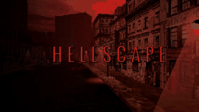
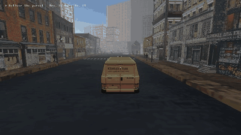
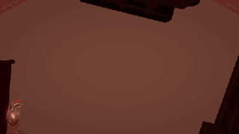
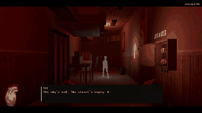
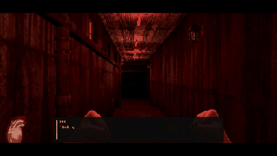
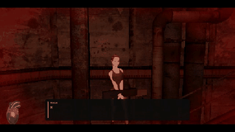
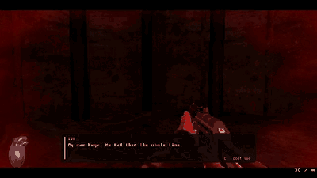
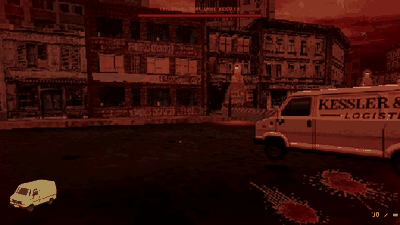
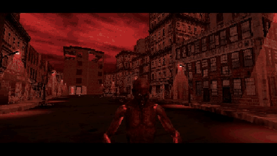

# HELLSCAPE

> *Everyone in this city has already died once. Die again, and you become one of them.*

**HELLSCAPE** is a first-person narrative horror game with a PS1/PSX look, built in Unity (URP). You are a night-shift delivery driver for Kessler & Vane Logistics. You walk home one morning and find your brother dead. You chase his killer to the roof, and the fall wakes you in a red, drowned version of the city.

## The story

You deliver parcels all night for Kessler & Vane. A cool box with no label. A back door at a clinic. Your brother Derek looked scared. At 7:12 AM you clock out and walk home, and what you find there makes you chase a killer to the roof.

In hell, the dead are sorted:

- **The Lost** are the dead with hidden sins. They drift as blue ghosts.
- **The Damned** are the ones whose sin came out, spoken aloud. They are what hunts you.
- **The bridge** at the end of the city judges everyone, you included.

Your choices decide how that judgement goes: who you spare, who you take with you, and whether you make people confess.

## Features

- **Choices that count.** Dialogue answers, mercy or violence, and who you save all feed into a final verdict.
- **An office act with puzzles.** Restore the fuses, crack the keypad, and piece together the CCTV footage while the ghosts of your dead colleagues talk back.
- **A chase through the silo complex.** A killer who drops in behind you, ladders, a lift, a spiral stair, and a jump into the dark.
- **A flood of blood.** Mash to swim up through it, and decide who you pull out with you.
- **A van escape and a boss fight.** Drive the Kessler & Vane van down the road through a horde of the damned. Lean out and shoot from the window while a monster hunts you, then fight it in a bridge arena.
- **Survival-horror cinematic cameras.** The van chase cuts between fixed set-ups, RE/PS2 style.
- **Diegetic UI.** A beating anatomical heart and a van that dents and smokes, with no health numbers.
- **Resident Evil-style door transitions** between areas.

## Game mechanics

### Judgement
- **Karma from conversations.** Every ghost offers several answers, some kind and some cruel. Each one is counted.
- **Kill or spare.** When the killer is on his knees, the choice is yours, and the story branches on it.
- **Who you save.** Colleagues you pull out of the flood, and those you leave, weigh on the verdict.
- **The verdict.** At the bridge, the ending is built from what you actually did.

### The dead
- **The Lost** drift and whisper. You can talk to them, and making one confess turns them.
- **The Damned** wander, lie dormant, feed, or crawl. They hunt by sight and by sound, scream before they charge, and alert the others nearby when hit.
- **The second death.** Anyone who dies again in the red city comes back as one of the Lost or the Damned, including people you failed to save.

### On foot
- **Fists and a rifle.** Jabs chain left and right. The rifle comes later and has to be reloaded.
- **Puzzles.** Find the fuses to restore power, work out the keypad code, and put the CCTV route in order.
- **Readable notes.** Ledgers, rotas and reports carry the clues and the backstory.
- **Chase sequences.** Ladders, a lift you have to call, an ambush and a blind leap, with the killer a few metres behind.
- **Swimming the flood.** Mash Space to keep your air up while the blood rises. Colleagues cling to you, and if your air runs low they drown first.
- **Checkpoints.** Dying sends you back to the start of the current act, not the start of the game.

### In the van
- **Deliveries.** The prologue is a morning delivery run through live traffic and pedestrians.
- **Damage you can see.** The van has no health bar. Its paint dents and scrapes, and it smokes when it is close to wrecked.
- **The horde.** The damned grab onto a slow van and tear at it. Keep moving and swerve to throw them off.
- **Drive-by shooting.** Hold right mouse to lean out of the window and fire. Middle mouse locks onto the boss's heart.
- **Ramming.** Hitting the boss at speed hurts him.
- **Cinematic cameras.** The chase cuts between side, kerb, crane and front cameras on its own.

### The boss
- **Three phases** with rolling blood orbs, slams, charges and the drowned climbing the rails.
- **A weak point.** His exposed heart takes triple damage.
- **Charges can be punished.** Dodge one and he is stunned.
- **Lose the van and the fight goes on.** You finish it on foot.

## Gameplay

| | |
|---|---|
|  |  |
| **Prologue:** the last delivery run | **Waking up** in the red city |
|  |  |
| **Office act:** the dead still talk | **Silo chase:** he is right behind you |
|  |  |
| **Silo fight:** a rifle from above | **The blood flood:** swim or drown |
|  |  |
| **Escape:** the van and the horde | **Kessler's true form** |

## Controls

| Action | Key |
|---|---|
| Move / look | WASD / mouse |
| Interact | E |
| Punch / shoot | Left mouse |
| Aim from the van | Hold right mouse |
| Lock on the boss | Middle mouse |
| Reload | R |
| Get in / out of the van | F |
| Reset a stuck van | Hold T |
| Pause | Esc |

## Running the project

1. Install **Git LFS** (`git lfs install`) *before* cloning, or the models and audio will be tiny text stubs.
2. Clone the repo and open the folder in Unity.
3. Open `Assets/Scenes/Prologue.unity` and press Play. `MainGameScene` is the main game.

For a quick test of the escape, use the menu **HellScape > Play > Car Chase**.

## Status

In development. The current build ends on **TO BE CONTINUED**.

## Credits

Built with Unity (URP, Forward+). Fonts: DOS Pixel, Oswald, Nosifer (OFL). Third-party models and audio belong to their respective authors.
